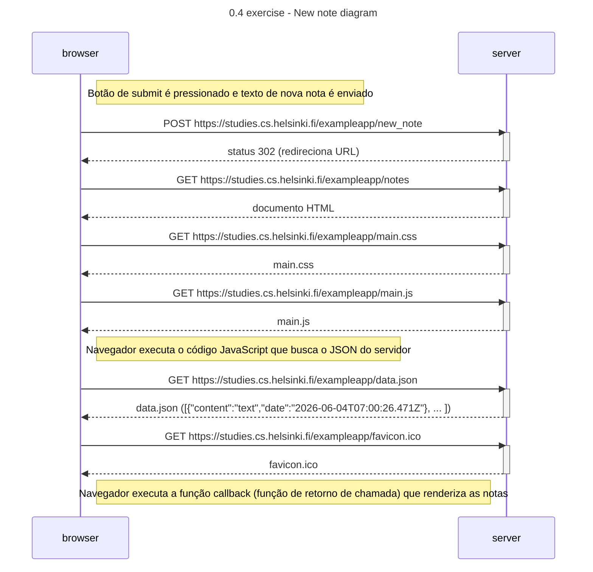

```mermaid
sequenceDiagram 
    title: 0.4 exercise - New note diagram

    participant browser
    participant server

    Note right of browser: Botão de submit é pressionado e texto de nova nota é enviado

    browser->>server: POST https://studies.cs.helsinki.fi/exampleapp/new_note
    activate server
    server-->>browser: status 302 (redireciona URL)
    deactivate server

    browser->>server: GET https://studies.cs.helsinki.fi/exampleapp/notes
    activate server
    server-->>browser: documento HTML
    deactivate server

    browser->>server: GET https://studies.cs.helsinki.fi/exampleapp/main.css
    activate server
    server-->>browser: main.css
    deactivate server

    browser->>server: GET https://studies.cs.helsinki.fi/exampleapp/main.js
    activate server
    server-->>browser: main.js
    deactivate server

    Note right of browser: Navegador executa o código JavaScript que busca o JSON do servidor

    browser->>server: GET https://studies.cs.helsinki.fi/exampleapp/data.json
    activate server
    server-->>browser: data.json ([{"content":"text","date":"2026-06-04T07:00:26.471Z"}, ... ])
    deactivate server

    browser->>server: GET https://studies.cs.helsinki.fi/exampleapp/favicon.ico
    activate server
    server-->>browser: favicon.ico
    deactivate server

    Note right of browser: Navegador executa a função callback (função de retorno de chamada) que renderiza as notas
```