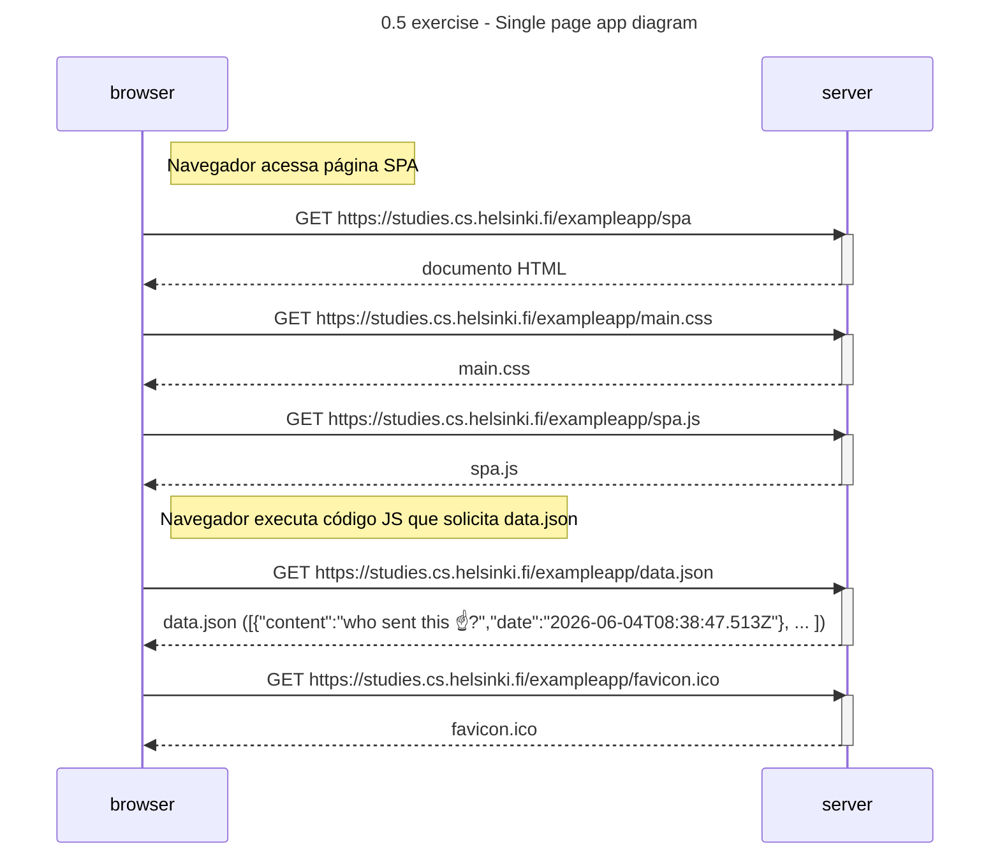

```mermaid
sequenceDiagram 
    title: 0.5 exercise - Single page app diagram

    participant browser
    participant server

    Note right of browser: Navegador acessa página SPA

    browser->>server: GET https://studies.cs.helsinki.fi/exampleapp/spa
    activate server
    server-->>browser: documento HTML
    deactivate server

    browser->>server: GET https://studies.cs.helsinki.fi/exampleapp/main.css
    activate server
    server-->>browser: main.css
    deactivate server

    browser->>server: GET https://studies.cs.helsinki.fi/exampleapp/spa.js
    activate server
    server-->>browser: spa.js
    deactivate server

    Note right of browser: Navegador executa código JS que solicita data.json

    browser->>server: GET https://studies.cs.helsinki.fi/exampleapp/data.json
    activate server
    server-->>browser: data.json ([{"content":"who sent this ☝️?","date":"2026-06-04T08:38:47.513Z"}, ... ])
    deactivate server

    browser->>server: GET https://studies.cs.helsinki.fi/exampleapp/favicon.ico
    activate server
    server-->>browser: favicon.ico
    deactivate server

```