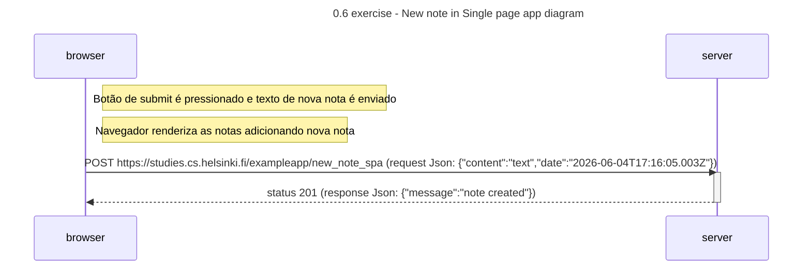

```mermaid
sequenceDiagram 
    title: 0.6 exercise - New note in Single page app diagram

    participant browser
    participant server

    Note right of browser: Botão de submit é pressionado e texto de nova nota é enviado
    Note right of browser: Navegador renderiza as notas adicionando nova nota

    browser->>server: POST https://studies.cs.helsinki.fi/exampleapp/new_note_spa (request Json: {"content":"text","date":"2026-06-04T17:16:05.003Z"})
    activate server
    server-->>browser: status 201 (response Json: {"message":"note created"})
    deactivate server
```